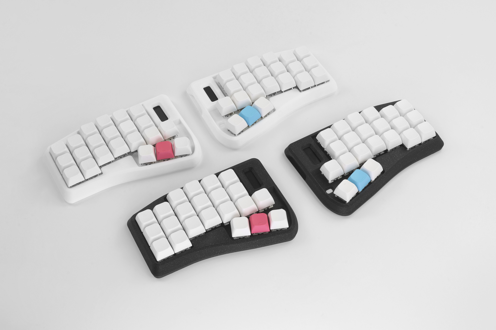
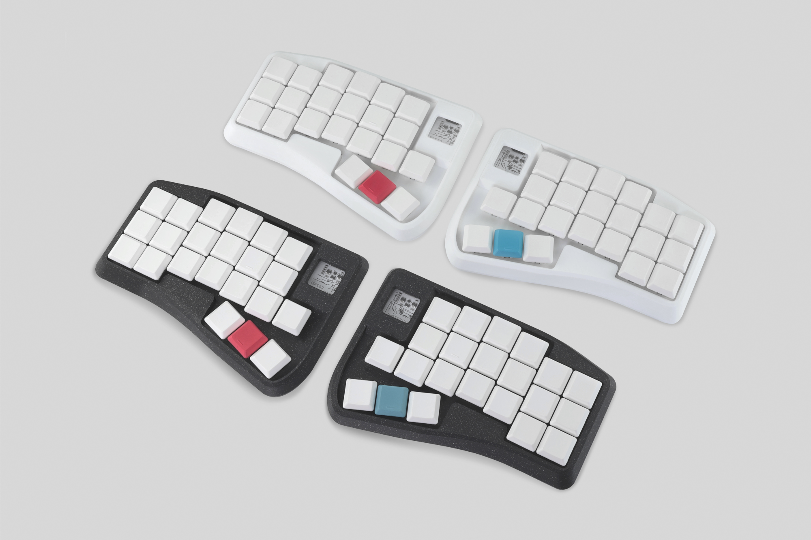
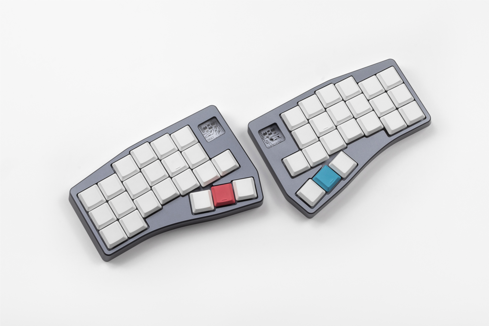
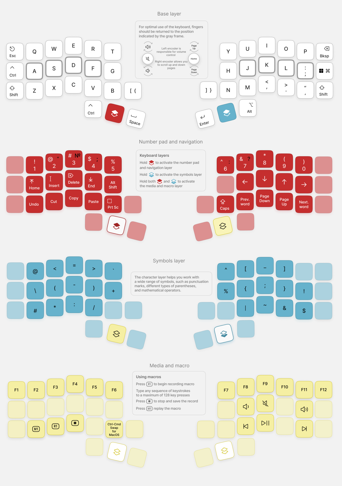
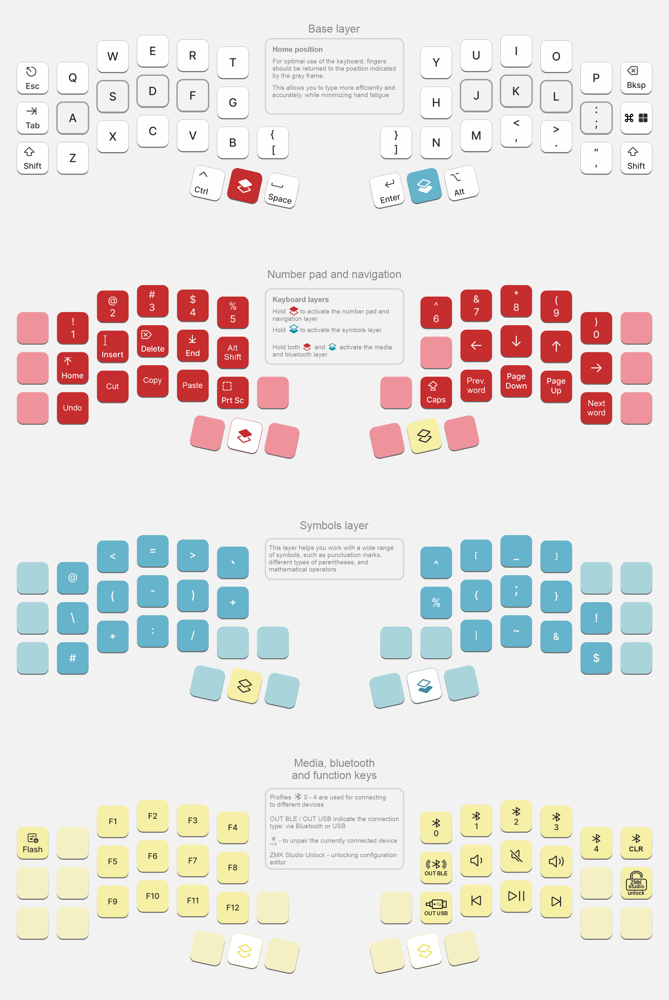

# Imperial44

Imperial44 is a compact split mechanical keyboard with three thumb keys on each half and support for hot-swappable encoders on either side

*Imperial44 keeps a 40% footprint, a 44-key layout, and clean ergonomics across three versions: the Wired Edition, the Wireless Edition, and the Wireless Metal Edition.*

## Design philosophy
Imperial44 v4 combines futuristic styling, a compact form factor, and practical ergonomics. The Wired Edition is built for a feature-rich daily setup, the Wireless Edition adds Bluetooth portability, and the Wireless Metal Edition brings the same idea into a premium aluminum body

## Features
- Split, ergonomic design
- 44 fully programmable keys and 15 additional layers for all your tasks
- Optional encoder support on either half
- Hot-swappable PCB (MX sockets)

### Wired Edition
- Powered by RP2040 and QMK firmware
- USB-C connection between halves
- Easily remap any key and customize your keyboard with [Vial](https://eh.industries/vial)
- OLED display and active-layer indicator

### Wireless Edition
- Powered by nRF52840 and RMK/ZMK firmware
- Bluetooth connectivity for up to 6 devices
- 120 mAh battery with up to 3 weeks of use
- USB-C connection

## This repository contains all files related to this keyboard
PCB and schematic can be found [here](https://oshwlab.com/yuriiq/)

### BOM
#### Imperial44 v4

| Components | Quantity (pcs) |
| --- | ---: |
| Imperial44 v4 PCB | 1 |
| RP2040 MCU, LQFN-56 | 2 |
| MX hotswap sockets | 44 |
| 1N4148W diodes, SOD-523F | 44 |
| Resistor 0402 5.1 kΩ | 8 |
| Resistor 0402 1 kΩ | 2 |
| Resistor 0402 200 Ω | 2 |
| Resistor 0402 27 Ω | 4 |
| Capacitor 0402 1 nF | 4 |
| Capacitor 0402 15 pF | 4 |
| Capacitor 0402 100 nF | 10 |
| Capacitor 0402 2.2 µF | 2 |
| SMD LED SK6803MINI-E-001 | 2 |
| P-channel MOSFET, SOT-23, JSM2301S | 2 |
| SMD tactile switch TS-1187F-1526 | 4 |
| LDO, SOT-23-3, 662K | 2 |
| SPI flash W25Q32JVSSIQ | 2 |
| SMD USB connector USB-TYPE-C-021 | 2 |
| SMD USB connector USB-TYPE-C-018 | 2 |
| SMD crystal resonator 12 MHz XXHCCLNANF-12.000000MHZ | 2 |
| 3M bumpons (8 mm) | 8 |
| MagSafe ring (optional) | 2 |

#### Imperial44 v4 – Wireless Edition

| Components | Quantity (pcs) |
| --- | ---: |
| Imperial44 Wireless Edition PCB | 1 |
| E73-2G4M08S1C Bluetooth module | 2 |
| MX hotswap sockets | 44 |
| 1N4148W diodes, SOD-523F | 44 |
| B5819WS Schottky diode, SOD-323 | 2 |
| Resistor 0402 5.1 kΩ | 6 |
| Resistor 0402 100 kΩ | 2 |
| Resistor 0402 806 kΩ | 2 |
| Resistor 0402 2 MΩ | 2 |
| Resistor 0402 10 kΩ | 2 |
| Capacitor 0402 4.7 µF | 4 |
| SMD LED SK6803MINI-E-001 | 2 |
| P-channel MOSFET, SOT-23, JSM2301S | 4 |
| MSK12CO2-SZ SMD slide switch | 2 |
| LN2054Y42AMR linear Li-Ion battery charger, SOT-23-5 | 2 |
| ZX-SH1.0-2PWT SMD wire-to-board connector | 2 |
| AP2112K-3.3TRG1 LDO regulator, SOT-23-5 | 2 |
| SMD USB connector USB-TYPE-C-018 | 2 |
| TS5235A 250gf 025 SMD tactile switch | 2 |
| 3M bumpons (8 mm) | 8 |
| MagSafe ring (optional) | 2 |
| Plexiglass window for case (optional) | 2 |

## License
The files in this repository are licensed under the Creative Commons Attribution-NonCommercial-ShareAlike 4.0 International License

## Useful links

- Imperial44 v4:
  - [Case for 3D printing (STL)](stls/imperial44v4)
  - [Case model for editing (STEP)](step/imperial44v4)
  - [Circuit schematic](https://oshwlab.com/yuriiq/)

- Imperial44 v4 – Wireless Edition:
  - [Case for 3D printing (STL)](stls/imperial44-we)
  - [Case model for editing (STEP)](step/imperial44-we)
  - [Circuit schematic](https://oshwlab.com/yuriiq/)
  - [Case model for Metal Edition (CNC)](cnc)

### Firmware
- [Pre-compiled files](https://github.com/ergohaven/keymap_hub)
- Source code:
  - wired [QMK](https://github.com/ergohaven/vial-qmk)
  - wireless [RMK](https://github.com/ergohaven/rmk-eh)
  - wireless [ZMK](https://github.com/ergohaven/ergohaven-zmk)

## Availability
The complete keyboard (not a DIY kit) is available for purchase at [eh.industries](https://eh.industries/)
